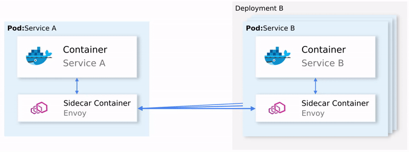

# `Service Mesh with Istio`
ref.: https://medium.com/google-cloud/back-to-microservices-with-istio-p1-827c872daa53

---

## `Service Mesh`
* An infrastructure layer that controls and observes the communication between services
* Enbables observability, security, policy enforcement, resilience, traffic management for microservices

---

## `Istio Architecture`
* Data Plane
  - Envoy Proxy: injected sidecar container
* Control Plane
  - Pilot: supplies all sidecars with updates of the service mesh config.
  - Mixer: enforces network policies and collects telemetry info to Prometheus
  - Citadel: issues and rotates internal certificates

---

## `The Data Plane`

---

## `The Control Plane`

---

## `Prerequisites`
* Resources req.: 4vCPU, 8GB RAM
* Minikube version 1.2 or later
* kubectl version 1.15 or later
* VirtualBox version 6.0 or later
<section>
	<pre><code data-trim data-noescape>
brew install kubectl
brew cask install minikube
brew cask install virtualbox
brew link --overwrite kubernetes-cli
</code></pre>
</section>

---

## `Installing Istio`
<section>
	<pre><code data-trim data-noescape>
minikube start --memory=5120
eval $(minikube docker-env)

cd istio_install
kubectl apply -f 1-istio-init.yaml
kubectl get po -n istio-system

kubectl apply -f 2-istio-minikube-reduced.yaml
kubectl get po -n istio-system

kubectl apply -f 3-kiali-secret.yaml
  </code></pre>
</section>

---

## `External IP`
<section>
	<pre><code data-trim data-noescape>
minikube tunnel // run with another command prompt

EXTERNAL_IP=$(kubectl -n istio-system get service istio-ingressgateway -o    
  jsonpath='{.status.loadBalancer.ingress[0].ip}')
echo "$EXTERNAL_IP minikube.me" | sudo tee -a /etc/hosts
cat /etc/hosts
  </code></pre>
</section>

---

## `Application Architecture`
* SA-Frontend service: serves the frontend Reactjs application.
* SA-WebApp service: handles requests for Sentiment Analysis.
* SA-Logic service: performs sentiment analysis.
* SA-Feedback service: receives feedbacks from the users about the accuracy of the analysis.

---

## `Application Architecture`

---

## `Istio Proxies`
* Sidecar Injection

<section>
	<pre><code data-trim data-noescape>
kubectl label namespace default istio-injection=enabled

kubectl apply -f resource-manifests/kube
kubectl get po
</code></pre>
</section>

---

---

## `Ingress Gateway`
* Positions at the edge of the cluster and on incoming traffic enables routing, load balancing, security, and monitoring.

<section>
	<pre><code data-trim data-noescape>
minikube tunnel

EXTERNAL_IP=$(kubectl -n istio-system get service istio-ingressgateway -o jsonpath='{.status.loadBalancer.ingress[0].ip}')
echo "$EXTERNAL_IP minikube.me" | sudo tee -a /etc/hosts
cat /etc/hosts
</code></pre>
</section>

---

## `Ingress Gateway Resource`
* A Custom Resource Definition to specify the Ports, Protocol and Hosts for incoming traffic.

<section>
<pre><code data-trim data-noescape>
kubectl apply -f resource-manifests/istio/http-gateway.yaml
</code></pre>
</section>

---

## `VirtualService Resource`
* The VirtualService instructs the Ingress Gateway to route the requests into the cluster.
  - Exact path /should be routed to SA-Frontend to get the Index.html
  - Prefix path /static/* should be routed to SA-Frontend to get any static files needed by the frontend.
  - Paths matching the regex should be routed to SA-Frontend as it is an image, that the page needs to show.

---

## `Configure VirtualService`
<section>
<pre><code data-trim data-noescape>
kubectl apply -f resource-manifests/istio/sa-virtualservice-external.yaml
</code></pre>
</section>

---

---

## `Sentiment Analysis app`
`http://{EXTERNAL-IP}/`

---

## `Kiali`
* Provides observability for services and traffic among them.

<section>
<pre><code data-trim data-noescape>
kubectl port-forward \
    $(kubectl get pod -n istio-system -l app=kiali \
    -o jsonpath='{.items[0].metadata.name}') \
    -n istio-system 20001
http://localhost:20001/
</code></pre>
</section>

---

## `Grafana`
* Provides Metrics Visualization: the metrics collected by Istio are scraped into Prometheus and Visualized using Grafana

<section>
<pre><code data-trim data-noescape>
kubectl -n istio-system port-forward \
    $(kubectl -n istio-system get pod -l app=grafana \
    -o jsonpath={.items[0].metadata.name}) 3000
http://localhost:3000
</code></pre>
</section>

---

## `Load Testing`
<section>
<pre><code data-trim data-noescape>
while true; do \
curl -d '{"sentence":"I love Jogobella!"}' \
-H "Content-Type: application/json" \
-X POST http://$EXTERNAL_IP/sentiment; \
sleep .8; done
</code></pre>
</section>

---

## `Jaeger`
* Provides Tracing

<section>
<pre><code data-trim data-noescape>
kubectl port-forward -n istio-system \
    $(kubectl get pod -n istio-system -l app=jaeger \
    -o jsonpath='{.items[0].metadata.name}') 16686
http://localhost:16686
</code></pre>
</section>

---

## `Tracing with Jaeger`

---

## `Propagating Headers`

---

## `Jaeger Code Dependencies`
* See `pom.xml and application.properties`

---

## `Traffic Management`
* Dynamic request routing: Canary deployments, A/B testing,
* Load balancing: Simple and Consistent Hash balancing,
* Failure Recovery: Timeouts, retries, circuit breakers,
* Fault Injection: Delays, abort requests etc.

---

## `A/B Testing`
* Try both versions of the app at the same time and collect metrics.

<section>
<pre><code data-trim data-noescape>
kubectl apply -f resource-manifests/kube/ab-testing/sa-frontend-green-deployment.yaml

curl --silent http://$EXTERNAL_IP/ | tr '"' '\n' | grep main
curl --silent http://$EXTERNAL_IP/ | tr '"' '\n' | grep main
</code></pre>
</section>

---

## `Destination Rules`
* Specify policies that apply to the traffic intended for the instances of this Service
* Load balancing: round robin and consistent hash

---

<section>
<pre><code data-trim data-noescape>
kubectl apply -f resource-manifests/istio/ab-testing/destinationrule-sa-frontend.yaml

curl --silent -H "version: yogo" http://$EXTERNAL_IP/ | tr '"' '\n' | grep main

kubectl delete -f resource-manifests/kube/ab-testing/sa-frontend-green-deployment.yaml
kubectl delete -f resource-manifests/istio/ab-testing/destinationrule-sa-frontend.yaml
</code></pre>
</section>

---

## `Shadowing and Mirroring`
* Mirror the requests into a second instance that has a change and evaluate it.
* when the sa-web-app makes a request towards sa-logic this goes through the sidecar envoy, which via the VirtualService is configured to route to the subset v1 and mirror to the subset v2 of the sa-logic service.

---

---

## `Mirroring with VirtualService and DestinationRule`
<section>
<pre><code data-trim data-noescape>
kubectl apply -f resource-manifests/kube/shadowing/sa-logic-service-buggy.yaml
kubectl get pods -l app=sa-logic --show-labels

kubectl apply -f resource-manifests/istio/shadowing/sa-logic-subsets-destinationrule.yaml
kubectl apply -f resource-manifests/istio/shadowing/sa-logic-subsets-shadowing-vs.yaml
</code></pre>
</section>

---

## `Load Testing`
* Check Grafana Incoming Success Rate for the buggy version of sa-logic-default
<section>
<pre><code data-trim data-noescape>
while true; do curl -v http://$EXTERNAL_IP/sentiment \
    -H “Content-type: application/json” \
    -d ‘{“sentence”: “I love yogobella”}’; \
    sleep .8; done
</code></pre>
</section>

---

## `Canary Deployments`
* The process of rolling out a new version of an application to a small set of users to verify the absence of issues.
* Then with a higher assurance of quality releases to the wider audience.

---

## `Configuring and Testing`
<section>
<pre><code data-trim data-noescape>
kubectl apply -f resource-manifests/istio/canary/sa-logic-subsets-canary-vs.yaml

while true; do \
   curl -i http://$EXTERNAL_IP/sentiment \
   -H “Content-type: application/json” \
   -d ‘{“sentence”: “I love yogobella”}’ \
   --silent -w “Time: %{time_total}s \t Status: %{http_code}\n” \
   -o /dev/null; sleep .1; done
</code></pre>
</section>

---

## `Timeouts and Retries`
* The network is NOT reliable and we need Timeouts and Retries.
* The buggy version of sa-logic simulates the unreliability of the network.
* Solutions:
  - Timeout if the service takes longer than 8 seconds.
  - Retry on failed requests.

---

## `Configuring and Testing`
* Check the Grafana Incoming Success Rate for sa-web-app.default

<section>
<pre><code data-trim data-noescape>
kubectl apply -f resource-manifests/istio/retries/sa-logic-retries-timeouts-vs.yaml
kubectl delete deployment sa-logic-buggy
kubectl delete virtualservice sa-logic
</code></pre>
</section>

---

## `Circuit Breaker and Bulkhead patterns`
* The Circuit Breaker stops requests going to an instance of an unhealthy service, and the client’s requests are forwarded to the healthy instances to increase success rate.
* The Bulkhead pattern isolates failures from taking the whole system down, if Service B is in a corrupt state and a client makes requests to Service B resulting the client uses up its own thread pool and won’t be able to serve other requests.

---

## `Cleanup`
<section>
<pre><code data-trim data-noescape>
eval $(minikube docker-env --unset)
minikube delete
</code></pre>
</section>
