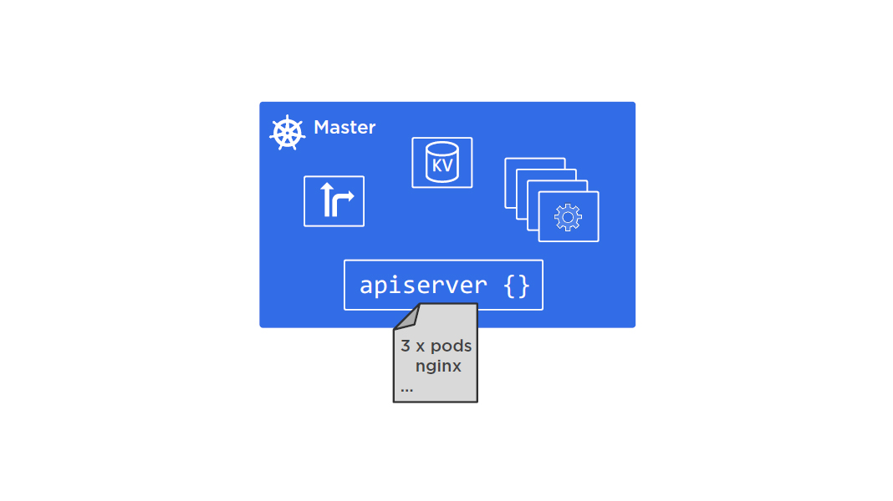
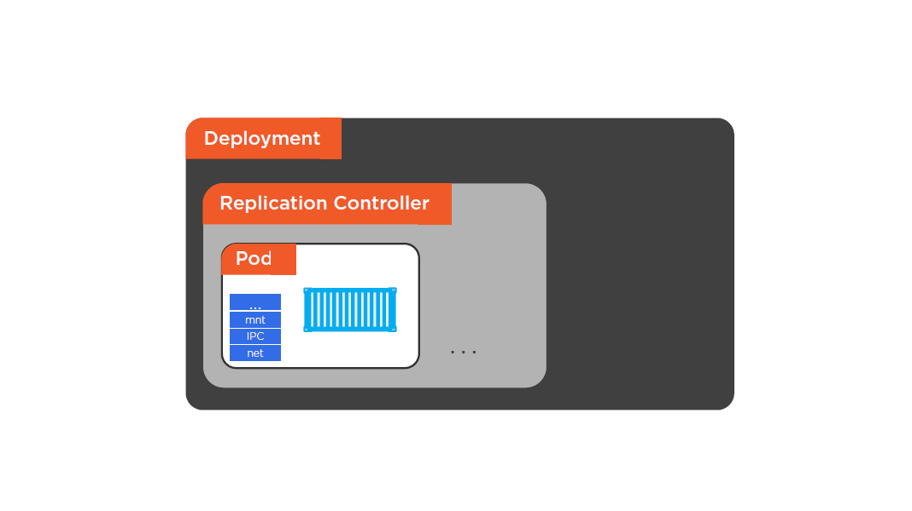
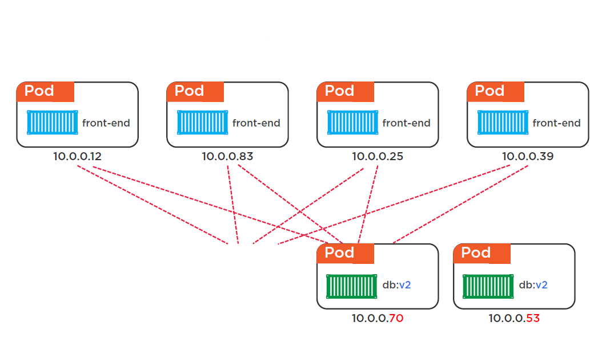
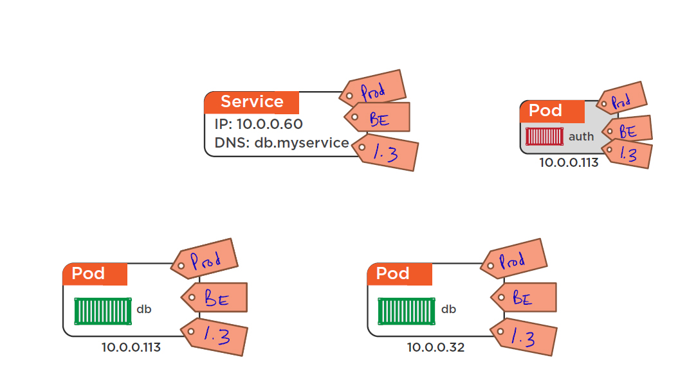
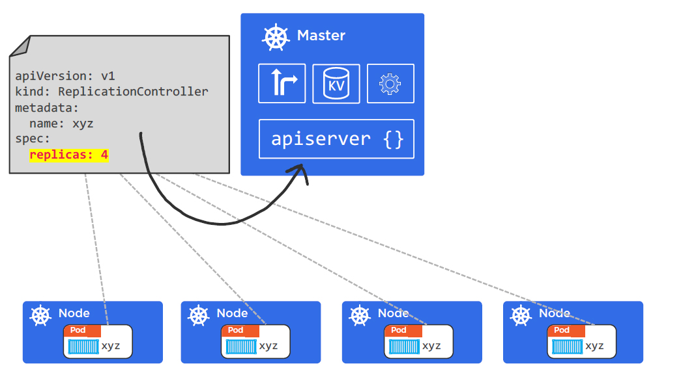

# microservices and Kubernetes


---

## Agenda
* Why microservices?
* Microservices design principles
* What is Kubernetes?
* Kubernetes Architecture and operational model
	- 	Masters
	-	Nodes
	-	Pods
	-	Services
	- 	Deployments
* Workshop

---

## Why microservices?


---


---


## Benefits of microservices
* Sizable microservices provide
	-	Efficently scalable and high performance applications
	-	Flexible applications
* Applications powered by multiple services
* Small service with a single responsibility
* Lightweight communication mechanism
* Technology agnostic API
* Independent data storage
* Independently changable and deployable
* Centralized tooling for management

---


---

## The monolithic
* Typical enterprise application
* No restriction in size
* Large codebase, longer development time
* Challenging deployment
* Inaccesible features
* Fixed technology stack
* High levels of coupling
* Failure could affect whole system
* Scaling requires duplication
* Single service on server
* Minor change could result in complete rebuild

---

## Characteristics of microservices
* Responds to change quickly
* Reliability
* Business domain driven design
* Automated test tools
* Release and deployment tools
* On-demand hosting technology
* On-demand cloud services
* Embrace new technology
* Asynchronous communication technology
* Simpler server side and client side technology

---

* Shorter development times
* Reliable and faster delpoyment
* Enable frequent updates
* Decouple the changable parts
* Security
* Increase uptime
* Fast issue resolution
* Highly scalable and better performance
* Better ownership and knowledge
* Rich technology
* Enable distributed teams

---

## Micorservices design principles


---

## High cohesion
* Single responsibility
* Change reason represents
	-	A business function
	-	A business domain
* Encapsulation principle
	-	OOP principle
* Easily rewritable code
* Benifits
	-	Scalability
	-	Flexibility
	-	Reliability

---

## Autonomous
* Loose coupling
* Contract and interfaces
* Stateless
* Indenpently changeable
* Indendently deployable
* Backward compatible
* Concurrent development

---

## Business domain centric
* Service represents business function
* Scope of service
* Bounded context from DDD
* Identify boundaries/seams
* Shuffle code if required
	-	High cohesion
* Responsive to business change

---

## Resilience
* Embrace failure
* Degrade functionality
* Default functionality
* Multiple instances
* Exception or errors
* Network issues
	-	Delays
	-	Unavailability
* Validation
	-	service to service
	-	client to service

---

## Observable
* System health
	-	Status, logs, errors
* Centralized monitoring
* Centralized logging
* Benefits:
	-	Distributed transactions
	-	Quick problem solving
	-	Quick delpoyment required feedback
	-	Data used for capacity planning
	-	Data used for scaling
	-	Monitor business data

---

## Automation
* Tools to reduce testing
* Tools to provide quick feedback
* Tools to provide quick deployment

---

## What is Kubernetes?
* Born in Google
* Donated to CNCF in 2014 (open source)
* Written in Go/Golang
* https://github.com/kubernetes/kubernetes
* IRC, @kubernetesio, slack.k8s.io, Meetups…

---

## Data center as a computer

Note:
* Kubernetes is a data center OS.
	-	Data center: a pool of compute, network and storage.
* Kubernetes is an orchestrator of microservices apps.
* Kubernetes is platform agnostic
	-	Bare metal, cloud instances, OpenStack, etc.

---

## Kubernetes Architecture
* Masters
* Nodes
* Pods
* Services
* Deployments

---

## Masters and Nodes

Note:
* master: API server (apiserver), cluster store (etcd), controller manager (kube-controller-manager), and scheduler (kube-scheduler)
* node: Kubelet, container runtime (Docker), kube-proxy
* A master is a collection of services that make up the control plane of the cluster.
* The API server is the only component in the control plane that we interact with directly.
* Kubelet exposes an endpoint on port 10255
* kube-proxy makes sure every pod gets its unque IP address, and lightweight load balancing.

---

## Operation model


---


---


---


---


---

## Masters


---

## Cluster store
* Persistent storage<br>
* Cluster state and config<br>
* Uses etcd
* Distributed, consistent, watchable…
* The “source of truth” for the cluster
* Have a backup plan for it!

---


---

## Controller manager
* kube-controller-manager
	-	Node controller
	-	Endpoints controller
	-	Namespace controller
	-	...
* Watches for changes
* makes sure that the actual state match the desired state

---


---

## Scheduler
* kube-scheduler<br>
	-	watches the new workloads and assigns to nodes<br>

---


---


---

## Nodes


---

## Kubelet
* The main Kubernetes agent
* Registers node with cluster
* Watches apiserver
* Instantiates pods
* Reports back to master
* Exposes endpoint on :10255

---


---

## Container runtime
* Pulling images
* Starting and stopping containers
* Docker or CoreOS rkt
* Kubernetes talks to Docker Remote API

---


---

## Kube-proxy
* Every pod gets its unique IP address.
* Lightweight load balancing on the node.

---


---


---

## Declarative desired state
* Declare the desired state of microservices in a manifest file.
* Post to the Kubernetes API server.
* Kubernetes implements it on the cluster.
* Kubernetes implements watch loops.

---


---



---


---


---


---


---


---

# Pods

---

## What is a Pod?
* Atomic unit of deployment in Kubernetes
	- 	Scaling unit
	-	No partial pod
* Containers always run inside of Pods
	-	Multiple containers can run inside of a single pod - tightly-coupled containers
* A sandbox environment to run containers
	-	Multiple containers in a single pod share the same environment, such as the same IP address
* A pod can only exist on a single node

---


---


---

## Tightly-coupled containers


---

## Scaling Pods


---

## Pod lifecycle


---

## Deploying pods
* Usually deploy pods using Replication Controller or Deployment
* Replication Controller take a pod definition and and deploy a desired replicas
	-	Also instantiate a background loop to watch the actual state
* Replication Controller will be superseded by Deployment

---


---



---

## Services
* Pod IPs are not reliable
* Services provide a reliable networking endpoint for pods
* Services an object in Kubernetes API like pods, replication controller and deployment
* Services provide stable DNS, IP addresses, support TCP and UDP, and load balancing
* Pods are connnected to services via labels

---


---


---


---


---



---


---


---


---



---


---


---


---


---


---


---


---


---

## Deployment
* Deployment is about declarative
	-	self-versioning, self-documenting, and repeatable deployments
* Makes rollout and rollback simple
* Deployments add features around Replication Controllers
	-	Replica Set as a next generation Replication Controller
	-	versioning, rolling updates, current releases, and rollbacks

---



---


---


---


---

## Installing Kubernetes Cluster
* Creates and starts two linux nodes: master and agent1
```
$ vagrant up
```
* Login to the master and change to root (Step 1)
```
$ vagrant ssh master
$ sudo su
```
* Turn off swap
```
$ swapoff -a
```

---

* Configure iptables to receive bridged network traffic
```
$ nano /etc/ufw/sysctl.conf
```
	-	Add the following lines to the end of sysctl.conf:
```
net/bridge/bridge-nf-call-ip6tables = 1
net/bridge/bridge-nf-call-iptables = 1
net/bridge/bridge-nf-call-arptables = 1
```
* Do the same Step 1 for the agent1 node and restart master and agent1
```
$ vagrant reload
```

---

* Login to the master and change to root (Step 2)
```
$ vagrant ssh master
$ sudo su
```
* Install ebtables and ethtool
```
$ apt-get install ebtables ethtool
```
* Do the same Step 2 for the agent1 node and restart master and agent1
```
$ vagrant reload
```

---

* Login to the master and change to root (Step 3)
```
$ vagrant ssh master
$ sudo su
```
* Install Docker
```
$ apt-get update
$ apt-get install -y docker.io
```
* Install HTTPS support
```
$ apt-get update
$ apt-get install -y apt-transport-https
```
* Install Curl
```
$ apt-get install curl
```

---

* Retrieve the key for the Kubernetes repo and add it to your key manager
```
$ curl -s https://packages.cloud.google.com/apt/doc/ \
apt-key.gpg | apt-key add -
```
* Add the kubernetes repo to your system
```
$ cat <<EOF >/etc/apt/sources.list.d/kubernetes.list \
deb http://apt.kubernetes.io/ kubernetes-xenial main \
EOF
```

---

* Install kubeadm, kubelet, and kubectl (End of Step 3)
```
$ apt-get update
$ apt-get install -y kubelet kubeadm kubectl
```
* Create the cluster (only for master node)
```
$ kubeadm init --apiserver-advertise-address 172.16.66.101\
 --pod-network-cidr=10.244.0.0/16
```
* Prepare your system for adding workloads, including the network plugin<br>
Open a NEW terminal window and login to master
```
$ vagrant ssh master
$ mkdir -p $HOME/.kube
$ sudo cp -i /etc/kubernetes/admin.conf $HOME/.kube/config
$ sudo chown $(id -u):$(id -g) $HOME/.kube/config
```

---

* Install the Weave network plugin
```
$ kubectl apply --filename https://git.io/weave-kube-1.6
```
* Check to see if the pods are running
```
$ kubectl get pods -o wide --all-namespaces
$ kubectl get nodes
```
* Untaint the master so that it will be available for scheduling workloads
```
$ kubectl taint nodes --all node-role.kubernetes.io/master-
```

---

* Setup PC to communicate with the master
	-	Copy the content of admin.conf outside of the master, and save it on PC
```
$ sudo cat /etc/kubernetes/admin.conf
```
* Check pods and nodes from PC
```
$ kubectl --kubeconfig ./admin.conf get pods -o wide \
 --all-namespaces
$ kubectl --kubeconfig ./admin.conf get nodes
```
* Do the same Step 3 for the agent1 node

---


* Join agent1 node to the cluster by copying the output of the ```kubeadm init``` on the master, execute it on agent1
* Check pods and nodes from PC until everything is running
```
$ kubectl --kubeconfig ./admin.conf get pods -o wide \
 --all-namespaces
$ kubectl --kubeconfig ./admin.conf get nodes
```

---

* Install Kubernetes dashboard
	-	From master:
```
$ kubectl create -f https://raw.githubusercontent.com/ \
 kubernetes/dashboard/master/src/deploy/recommended/ \
 kubernetes-dashboard.yaml
```
	-	From PC:
```
$ kubectl --kubeconfig ./admin.conf create -f \
 https://raw.githubusercontent.com/kubernetes/dashboard/ \
 master/src/deploy/recommended/kubernetes-dashboard.yaml \
```

---

* Granting admin privileges (for master only)
```
$ cat <<EOF | kubectl create -f - \
```
```
 apiVersion: rbac.authorization.k8s.io/v1beta1 \
 kind: ClusterRoleBinding \
 metadata: \
   name: kubernetes-dashboard \
   labels: \
     k8s-app: kubernetes-dashboard \
 roleRef: \
   apiGroup: rbac.authorization.k8s.io \
   kind: ClusterRole \
   name: cluster-admin \
 subjects: \
 - kind: ServiceAccount \
   name: kubernetes-dashboard \
   namespace: kube-system \
 EOF \
```

---

* Start proxy and check Kubernetes dashboard
```
$ kubectl proxy --accept-hosts='.*' --address=172.16.66.101
```
* Access from PC's browser
http://172.16.66.101:8001/api/v1/namespaces/kube-system/services/https:kubernetes-dashboard:/proxy/

---

## Deploy pods, services, rolling update and rollback
* Create namespace (From PC)
```
$ kubectl --kubeconfig ./admin.conf create namespace hello
```
* Create pod
```
$ kubectl --kubeconfig ./admin.conf apply -n hello -f \
 pod.yml
```
* Check pods and nodes
```
$ kubectl --kubeconfig ./admin.conf get pods -o wide \
 --all-namespaces
$ kubectl --kubeconfig ./admin.conf get nodes
$ kubectl --kubeconfig ./admin.conf describe pod hello-pod
```

---

* Delete pod
```
$ kubectl --kubeconfig ./admin.conf delete pods hello-pod \
 --namespace=hello
```
* Create replication controller
```
$ kubectl --kubeconfig ./admin.conf apply -n hello -f \
 rc.yml
```
* Check replication controller
```
$ kubectl --kubeconfig ./admin.conf get rc \
 --namespace=hello
```
* Delete replication controller
```
$ kubectl --kubeconfig ./admin.conf delete rc hello-rc \
 --namespace=hello
```

---

* Create a deployment
```
$ kubectl --kubeconfig ./admin.conf apply -n hello -f \
 deploy.yml
```
* Check a deployment
```
$ kubectl --kubeconfig ./admin.conf describe deploy \
 hello-deploy --namespace=hello
$ kubectl --kubeconfig ./admin.conf get deploy \
 hello-deploy --namespace=hello
```
* Check Replica Sets
```
$ kubectl --kubeconfig ./admin.conf get rs \
 --namespace=hello
```

---

* Create a service
```
$ kubectl --kubeconfig ./admin.conf apply -n hello -f \
 svc.yml
```
* Check service
```
$ kubectl --kubeconfig ./admin.conf describe svc hello-svc \
 --namespace=hello
$ kubectl --kubeconfig ./admin.conf get svc hello-svc \
 --namespace=hello
```
* Check endpoint object
```
$ kubectl --kubeconfig ./admin.conf describe ep hello-svc \
 --namespace=hello
$ kubectl --kubeconfig ./admin.conf get ep hello-svc \
 --namespace=hello
```

---

* Access service
	-	http://172.16.66.101:30001/
	-	http://172.16.66.102:30001/
* Delete service
```
$ kubectl --kubeconfig ./admin.conf delete svc hello-svc \
 --namespace=hello
```

---

* Rolling update
```
$ kubectl --kubeconfig ./admin.conf apply -n hello -f \
 deploy.yml --record
```
* Monitor the progress of the update
```
$ kubectl --kubeconfig ./admin.conf rollout status \
 deployment hello-deploy --namespace=hello
```
* Verify the update
```
$ kubectl --kubeconfig ./admin.conf get deploy \
 hello-deploy --namespace=hello
$ kubectl --kubeconfig ./admin.conf describe deploy \
 hello-deploy --namespace=hello
```

---

* Show update history
```
$ kubectl --kubeconfig ./admin.conf rollout history \
 deployment hello-deploy --namespace=hello
$ kubectl --kubeconfig ./admin.conf get rs \
 --namespace=hello
```
* Rollback
```
$ kubectl --kubeconfig ./admin.conf rollout undo \
 deployment hello-deploy --to-revision=1 --namespace=hello
```
* Verify the rollback
```
$ kubectl --kubeconfig ./admin.conf get deploy \
 hello-deploy --namespace=hello
$ kubectl --kubeconfig ./admin.conf rollout status \
 deployment hello-deploy --namespace=hello
```

---

* Rollback again
```
$ kubectl --kubeconfig ./admin.conf rollout undo deployment \
 hello-deploy --to-revision=2 --namespace=hello
```

---

## Questions?
