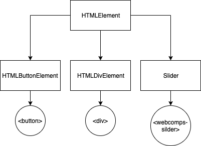
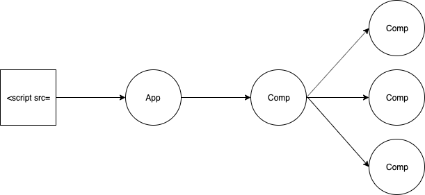
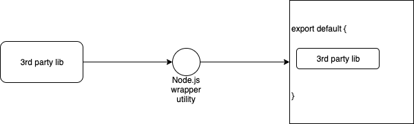
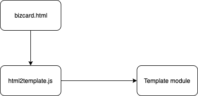
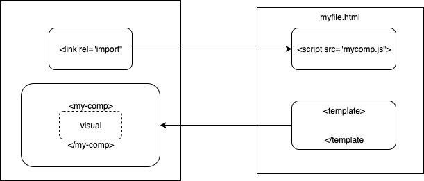
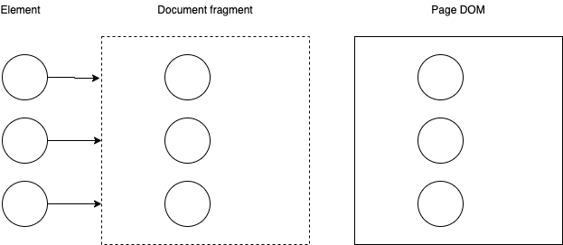
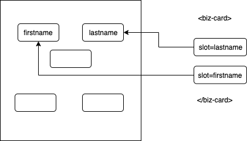

# Web Components

---

## `HTMLElement`
* Naming convention and namespace
* connectedCallback method
* slider1 and PhotoCarousel

---

 <!-- .element height="80%" width="80%" -->

---

## Reusable Components
* `attributeChangedCallback`
* `observedAttributes`
* `hasAttribute`, `getAttribute`, `setAttribute`
* Property and attribute reflection
* poly-search, slider

---

## Lifecycle methods
* `constructor`
* `connectedCallback`
* `disconnectedCallback`
* `adoptedCallback`
* lifecycle, countdwontimer, disconnected

---

## Modules
* Web components manage their dependencies
* CSS inside the web component
* Wraps third party libraries
* webharp

---

 <!-- .element height="80%" width="80%" -->

---

## Wrapping 3rd party libs as modules
* `https://github.com/mudcube/MIDI.js/`
* `https://github.com/backspaces/as-app3d/blob/master/bin/wraplib.js`
* `$ node ./bin/wraplib.js midi.min.js MIDI > midijs.wrapper.js`

---

 <!-- .element height="80%" width="80%" -->

---

## HTML/CSS Templating
* Template module `template.js`
* `html2template.js`
* bizcard

---

 <!-- .element height="80%" width="80%" -->

---

## HTMLImport and `<template>`
* HTMLImport polyfill: `html-imports.min.js`
* Non-module web component class
* Owner doc
* `<template>` and document fragment
* ShadowDOM with `<slot>`
* bizcard2

---

 <!-- .element height="80%" width="80%" -->

---

 <!-- .element height="80%" width="80%" -->

---

 <!-- .element height="80%" width="80%" -->
